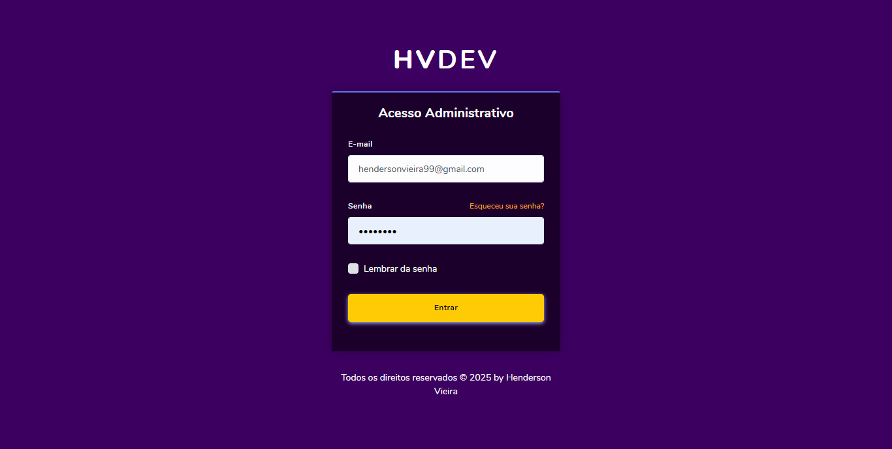
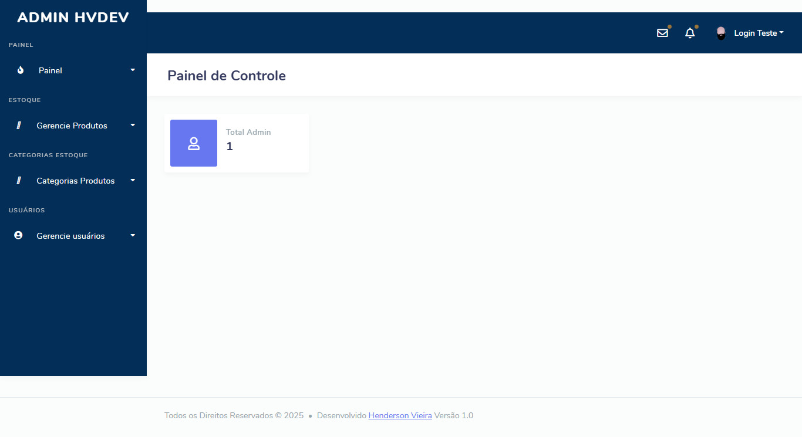
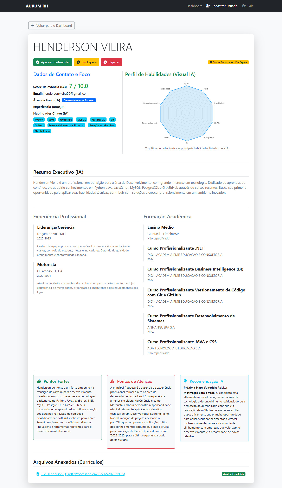

Sistema de Triagem Inteligente de Currículos — Dashboard RH com IA

Sistema web desenvolvido para triagem automatizada de currículos, integrando leitura de e-mails, processamento de anexos e análise assistida por Inteligência Artificial, com exibição dos dados em um dashboard administrativo.

O projeto foi concebido com foco em organização de dados, produtividade no recrutamento e experimentação prática de soluções baseadas em IA, servindo tanto como ferramenta funcional quanto como projeto de portfólio técnico.

🎯 Objetivo do Projeto

Este projeto tem como principais objetivos:

Automatizar a triagem inicial de currículos recebidos por e-mail

Extrair informações relevantes de forma estruturada

Apresentar os dados em um painel claro e utilizável para RH

Demonstrar a aplicação prática de IA integrada a sistemas web

Consolidar aprendizado em Laravel, arquitetura backend e fluxos assíncronos

🧠 Uso de Inteligência Artificial no Projeto

Este projeto utiliza Inteligência Artificial como ferramenta de apoio técnico em um escopo que, inicialmente, extrapolava meu nível de domínio completo.

A IA foi utilizada para:

Apoiar na concepção da arquitetura de análise de currículos

Auxiliar na modelagem de schemas de dados estruturados

Sugerir abordagens para processamento e classificação de informações

Apoiar a compreensão e implementação de fluxos mais avançados

Importante destacar que:

A IA foi utilizada como instrumento de aprendizado e aceleração

Toda a implementação foi compreendida, adaptada e validada

As decisões finais de arquitetura e lógica foram humanas

O foco sempre foi evolução técnica real, e não apenas entrega

Este processo resultou em um ganho significativo de aprendizado prático, especialmente em integração de serviços, processamento de dados não estruturados e organização de informações para dashboards administrativos.

<h2>🔐 Tela de Login</h2>

<h2>📊 Dashboard Administrativo</h2>

<h2>📄 Detalhes do Candidato</h2>

🖥️ Funcionalidades

Leitura de currículos enviados por e-mail (IMAP)

Download e armazenamento de anexos

Processamento e extração de dados assistida por IA

Classificação e score de relevância de candidatos

Dashboard administrativo para visualização

Visualização de currículos em PDF pelo painel

Modo de simulação (STUB) para demonstração pública

🧩 Arquitetura de STUBs (Versão Pública)

Para garantir segurança, privacidade e responsabilidade técnica, a versão pública deste repositório utiliza STUBs controlados em pontos sensíveis do sistema.

🔹 O que são os STUBs neste projeto?

Os STUBs são implementações simuladas que substituem integrações reais, permitindo:

Demonstração completa do fluxo do sistema

Execução segura em ambiente local

Avaliação técnica sem exposição de lógica crítica

🔹 STUBs Implementados
📌 Job de Análise de Currículos (IA)

O job real de análise com IA foi substituído por um Job Stub

Retorna dados estruturados simulados (nome, score, habilidades, resumo)

Mantém o fluxo assíncrono (Queue / Job) demonstrável

Não expõe prompts, regras proprietárias ou lógica de classificação real

📌 Leitura de E-mails (IMAP)

Implementado modo de simulação de e-mails

Currículos mockados são gerados localmente

Anexos simulados permitem visualização e processamento no dashboard

Evita dependência de servidores IMAP reais

📌 Integração com IA

Chamadas reais a serviços de IA não estão presentes

A versão pública retorna respostas simuladas coerentes

Mantém a estrutura de schema e contrato de dados

🔐 Por que utilizar STUBs?

Evita exposição de:

Credenciais

Prompts de IA

Regras de negócio sensíveis

Permite que recrutadores avaliem:

Arquitetura

Organização de código

Fluxos de dados

Qualidade estrutural do sistema

Mantém o projeto funcional e seguro para fins de portfólio

A versão completa e produtiva do sistema permanece privada.

🛠️ Tecnologias Utilizadas

PHP 8+

Laravel

Blade Templates

JavaScript

MySQL (ambiente real)

Filas e Jobs (Queue)

IMAP (simulado no repositório público)

Integração com IA (simulada)

Git e GitHub

🚀 Status do Projeto

✅ Funcional para fins de demonstração

✅ Dashboard navegável

✅ Fluxos simulados de ponta a ponta

ℹ️ Projeto em evolução contínua

Melhorias futuras planejadas:

Refinamento de scores e critérios de IA

Ampliação de filtros e buscas

Otimização de performance

Melhorias de UX no dashboard

📌 Observação Importante

Este projeto foi desenvolvido com finalidade educacional e de portfólio, demonstrando capacidade de:

Aprendizado contínuo

Adaptação a desafios técnicos complexos

Aplicação prática de tecnologias modernas

Uso consciente e responsável de IA no desenvolvimento

👤 Autor

Desenvolvido por Henderson Vieira

📄 Licença

Projeto de uso educacional e demonstrativo.
Não recomendado para uso em produção sem adaptações de segurança.
